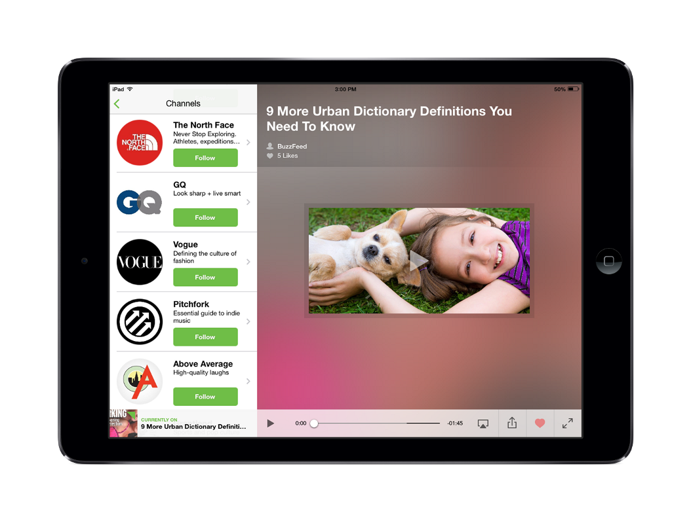

Today we’re releasing a brand new iPad app to complement our existing iPhone app and web app. We’ve worked really hard on refining Shelby and I’m proud to say this is the best app we’ve ever built. So what sets it apart from the other stuff we’ve built and the rest of the video apps on the App Store? Here’s my take.

###Getting started: choose your own adventure.
After opening the app, I’m greeted with two choices: Get Started or Login. If I’m a first-time Shelby user, I choose “Get started.” The title screen animates away, revealing an introduction, a selection of video to watch, and channels to follow. I’m also able to connect Facebook here or hold off until I’ve had a chance to use the app further.
This experience feels a bit like a “choose your own adventure” — I need to add video to my stream, but there are a few ways to do it. A lot of times user onboarding in apps feels very heavy handed—Flipboard requires an email address before they let you see any content—like I’m being pushed through a funnel toward something I’m not sure if I want, instead of letting me explore a magical world with a few helpful tips along the way. The approach we took here is much lighter weight and in keeping with more modern mobile approaches.

<blockquote class="twitter-tweet" lang="en">
Shelby.tv, an iPad app to help you discover new videos, no longer requires signups: <a href="http://t.co/MEwrhElpNe">http://t.co/MEwrhElpNe</a>
&mdash; Mashable (@mashable) <a href="https://twitter.com/mashable/statuses/447098614725509120">March 21, 2014</a></blockquote>

I checked out a few of the publishers in the channels section and followed the ones I tend to keep up with on a regular basis, like Vice and the NY Times. There’s a pretty good mixture of stuff in fashion, food, tech, news and more, but I’d love to see more here and also be able to search for other providers.

Here are a few examples of Channels in the app:

###The fastest video player on iOS I’ve ever experienced.
At this point, I watched a few videos and tried out the swipe-able video player, which we’ve put a lot of time into. It’s really fast — swipe up or down over the player, and the video changes to the corresponding one in the stream. On my home wifi connection (standard Time Warner Cable) I don’t experience any delays due to buffering, so changing videos here is way faster than even changing the channel on my TV.
So far I’ve had a pretty cool experience but I haven’t yet formally registered for Shelby. The experience is somewhat personalized (I’ve followed channels I’m interested in) and I’m still seeing recommendations in my stream. I still want a little more personalization, and I think it’s pretty clear I can get that by connecting Facebook or signing up. I’ve seen a few “sign up” banners in different parts of the app and I clicked one and signed up with my Facebook account. After confirming a few quick profile details and my bio, I’m back to watching video. Pretty simple and painless, and all of my prior work (following channels, etc) has been brought over to my account, so I don’t need to start again.

**I really wish more apps took this approach with signup.**

###Relevant content every day.
I use the app every day over coffee in the morning and after dinner in the evening. Each time I open it, I find interesting video. These videos are from a different place each time: sometimes I find the community sharing interesting stuff (found in Explore), sometimes I find the recommendations from Shelby particularly impressive (mostly because they were things I would never search for or come across), and other times I just enjoy the vanilla stuff from TED and the other channels I follow.

###Straightforward, beautiful design.
I’m really glad we kept the design simple. I can focus more on video and less on how the hell I’m supposed to work the app.

##What’s Next
Overall, the app feels simple and fun to use whether I’m on the couch connected to AppleTV catching up on the day’s video or showing a friend a video that I’ve discovered lately. So what is the app missing?

**I want even more context around videos.** What haven’t my friends seen yet? What’s trending nearby? If I’m on the couch, I want videos that are longer. If I’m on my phone in the elevator, I want quick 1 minute videos to watch. We’re thinking a lot about what information is relevant and how/when to present it to people.

**Better controls for improving the quality of my stream and facilitating discovery.** Provided you have a strong social graph and like the video sources we’ve integrated into the app so far, Shelby is a pretty strong video experience. The problem is that everyone has a unique taste fingerprint and while our recommendations do a good job of surfacing new and interesting videos, they take some time to work. I’d love to see more options to build a stream that’s relevant to my interests even before I sign up.

While I can’t completely give away our roadmap, I can say that the stuff in the list above is part of how we’re thinking about where to take Shelby next. If you’re interested in learning more, shoot me an email at chris[at]shelby.tv. I’d love to chat.