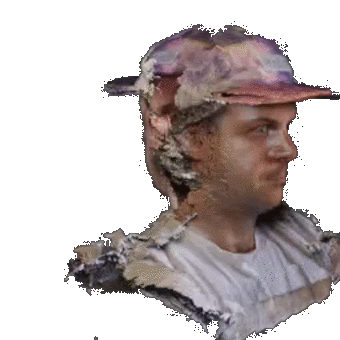

Hi, I'm Chris. I am an early stage investor and advisor. I'm based in NYC, but I'm most at home on the internet.

As an investor, I was most recently leading gaming and creative technology investments for [Samsung NEXT Ventures][0], Samsung Electronics' early stage venture capital arm, in NYC. I am also a Venture Partner and Advisor to [Joyance Partners][1] & [SocialStarts](http://socialstarts.com). You can read more about my investments [here][8].

Before I became an investor, I was a Director of Product at [Vimeo][2] & VHX helping video creators monetize and distribute their video online. Before that, I worked with the R&D team at Samsung and some the world's best content partners to re-imagine Samsung’s smart TV platform. My startup origins date back to 2011, when I moved to New York to build [Shelby.tv][3] (TechStars NY '11) with some talented people. Our team was acquired by Samsung in 2014 to help build the future of TV.

I've been fortunate to learn from a supportive bunch of people in tech (most of whom I met on Twitter) and went to school at [Vanderbilt][4] and [Cornell][5]. I also worked in [healthcare][7] for a few years.

I'm a native New Yorker, have lived in 6 states and been to all 50. I occasionally play DOTA2, so if you play, hit me up on Twitter for a game!

## Themes

I have found two guiding themes in my career and in investments that naturally catch my eye. If you ever want to talk about these with me, please reach out on Twitter!

### Networked creativity
I grew up on the internet and through it I discovered P2P technology, gaming, my favorite music, some of my best friends, and some really compelling ideas. As I have grown older, I have traced my love of learning and technology back to a belief that access to these networks and communities I found via the internet was instrumental in my own personal growth.

My work at Shelby.tv was focused primarily on video discovery as a means of addressing this larger theme of helping people discover new things through video networks. My investment in Eternal stems from a similar place of wanting to see intimate, fun communities on the Internet that unlock peoples' ability to just be themselves.

I am excited by technologies like Bitcoin, crypto networks and P2P wireless mesh networks - these are all a signal of where I think the internet is headed over the next few decades. As mobile computing power increases and the infrastructure for these new decentralized technologies matures, I think we'll see a shift in how many of the huge networks on the web are structured, governed, and even owned. Coupled with 3D game engines and other creative application-layer technology, I think we're going to see an explosion in the creative potential of the world.

### Human-centered computing
Steve Jobs is famously attributed to the quote [“a computer is the equivalent of a bicycle for the mind.”][9] I love this quote and it gets to another reason I love technology - the best technology enhances and deepens the human experience instead of detracting from it.

Modern software development is amazing and enabled by a host of developer friendly tools and technologies. The rise of devops, APIs, lambda functions, GraphQL, mobile SDKs and containers allow for quick scaling and faster execution on new ideas. More recently, no-code tools like Airtable, Coda, and Zapier have made it possible for almost anyone to build simple apps (personal CRM, anyone?). As these tools mature even further and users see power of having more personalization and control of their data, I expect that each of us will want to write software that goes to work for us (probably without writing code), rather than house our data in inflexible tools and use UIs that have been designed for scale and without our specific needs in mind.

I look forward to an internet that fosters this sense of individual control of our data and computing resources rather than putting our data and compute experience fully in control of a few large companies.

As our information and network structures evolve towards being more human-centric, I also believe our computing will evolve in a similar fashion toward the the more immersive and human (desktop toward mobile, 2D websites toward 3D games, voice/audio computing, etc.) I am also bullish on machine learning as a tool to help us achieve "flow states" to be more effective humans.

I am not one of those people who believes that AI will entirely replace humans. Instead, I think humans will use AI and tools to make themselves more creative and allow us to do more of the things we want to do in the time that we have.

[0]:  https://samsungnext.com/ventures/
[1]:	http://joyancepartners.com
[2]:	http://vimeo.com
[3]:	http://shelby.tv
[4]:	http://engineering.vanderbilt.edu/
[5]:	http://www.johnson.cornell.edu/
[6]:	http://www.brventurefund.com/
[7]:	http://www.mckesson.com/
[8]:    https://chriskurdziel.com/category/investments.html
[9]:	https://www.youtube.com/watch?v=ob_GX50Za6c
